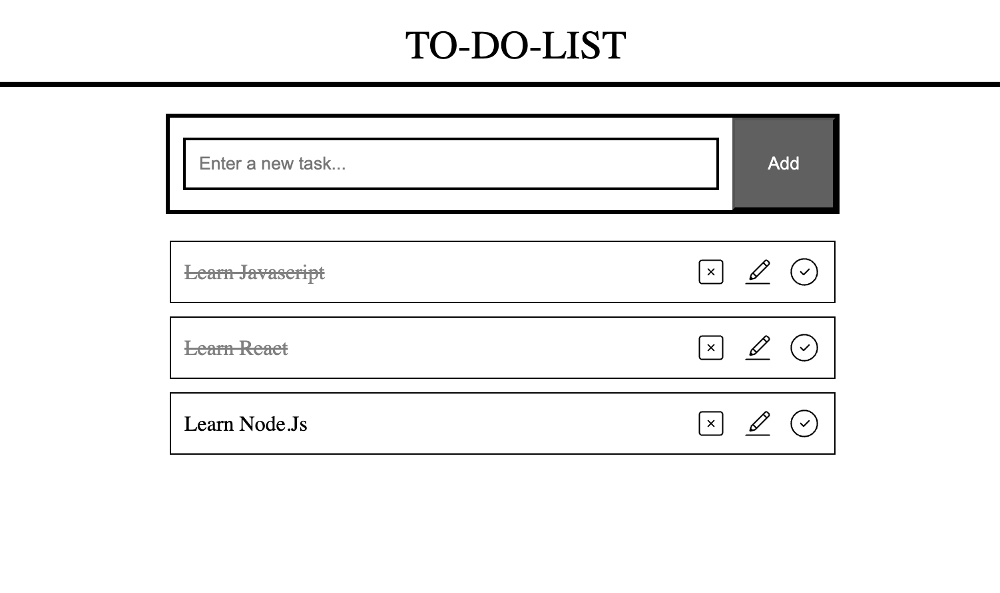

# 📝 React To-Do List App

This project is a simple To-Do List application built with React.  
It allows users to manage their daily tasks efficiently through a clean interface.

## 🚀 Features

- Add new tasks
- Mark tasks as completed
- Delete tasks
- Clean and minimal UI

## 📸 Screenshot

## 🛠️ Technologies Used

- React
- JavaScript
- HTML
- CSS

## ⚙️ Installation

Clone the repository:

git clone https://github.com/Omer-Girginer/To-do-app

Install dependencies:

npm install

Run the application:

npm start

## 🎯 Purpose

This project was created to practice core React concepts such as components, state management, and event handling.

## 👨‍💻 Author

Ömer Girginer
